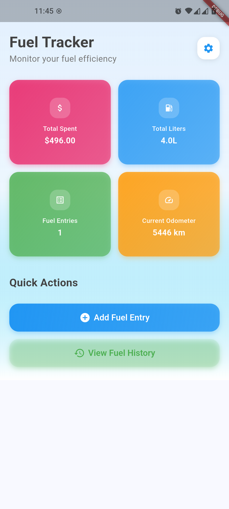
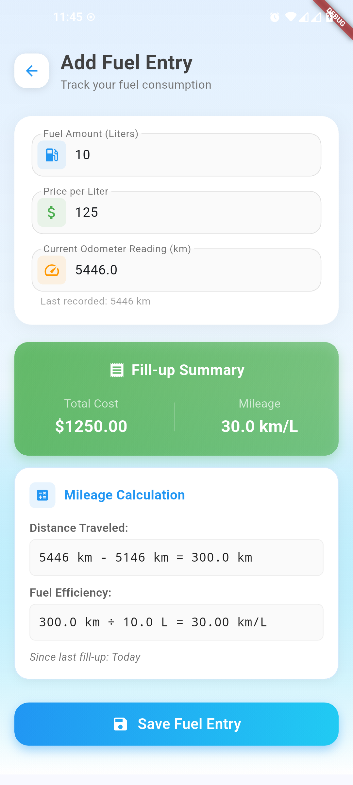
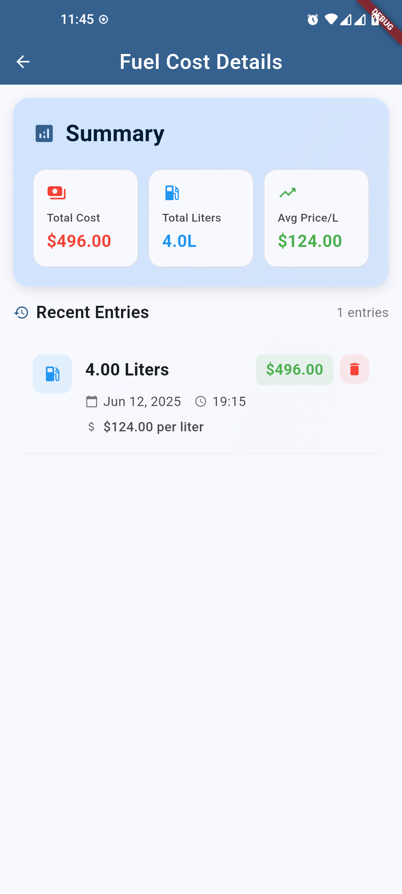

# Fuel Cost Tracker

A beautiful Flutter app for tracking your fuel consumption and costs with a modern, professional interface.

## Screenshots

<div style="display: flex; gap: 10px; flex-wrap: wrap;">
  
  
  
</div>

## Features

- **Smart Dashboard** - Real-time statistics and beautiful data visualization
- **Easy Entry** - Quick fuel entry with automatic cost calculation
- **Mileage Tracking** - Calculate fuel efficiency when odometer data is provided
- **Modern UI** - Material 3 design with gradients and smooth animations
- **Responsive** - Works perfectly on all screen sizes
- **Dark Mode** - Automatic light/dark theme support
- **Data Management** - Comprehensive settings for data control

## Getting Started

### Prerequisites

- Flutter 3.32.1 or higher
- Dart SDK

### Installation

1. Clone the repository:
```bash
git clone <repository-url>
cd fuel_cost
```

2. Install dependencies:
```bash
flutter pub get
```

3. Run the app:
```bash
flutter run
```

### Build for Production

#### Web
```bash
flutter build web --release
```

#### Mobile
```bash
# Android
flutter build apk --release

# iOS
flutter build ios --release
```

## Key Features

### Dashboard
- Total fuel cost tracking
- Fuel consumption monitoring
- Average price per liter
- Entry count statistics

### Fuel Entry
- Intuitive form with validation
- Real-time cost preview
- Mileage calculation
- Odometer reading support

### History & Analysis
- Beautiful entry cards
- Detailed fuel history
- Pull-to-refresh support
- Smart delete functionality

### Settings
- Clear specific data types
- Reset options
- Data management tools

## Technical Details

- **Framework:** Flutter 3.32.1
- **Language:** Dart
- **Design:** Material 3
- **Storage:** SharedPreferences
- **Platforms:** Web, iOS, Android, macOS

## Project Structure

```
lib/
├── main.dart                    # App entry point
├── models/fuel_entry.dart       # Data models
├── screens/                     # UI screens
│   ├── add_fuel_screen.dart
│   ├── fuel_history_screen.dart
│   └── settings_screen.dart
└── services/                    # Business logic
    └── fuel_storage_service.dart
```

## Design Highlights

- Material 3 design system
- Gradient backgrounds for visual appeal
- Smooth animations and transitions
- Consistent theming across all screens
- Professional color palette
- Responsive layout design

## License

MIT

## Platform Support

Web, iOS, Android, macOS